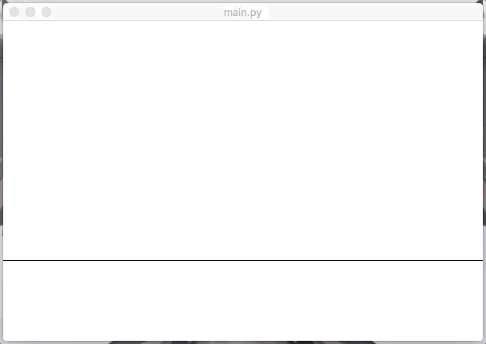

Cartpole-v0
===========



### Goal

The goal is to balance the pole on the cart for an average of 190+ coonsecutive frames over 100 tests. For more info, see the [official challenge](https://gym.openai.com/envs/CartPole-v0/)

### Model

This model uses a multi-layered neural net trained through randomly running instances of the pole-balancing simulation. 

### Results

This model performs fairly well, usually beating the challenge and sometimes training well enough to seemingly balance the pole indefinitely. Variability occurs through randomness of training data.

### Getting Started

To train and test the model, run:

```
python3 main.py
```

